<div align="center">

# STRATA — Self-Terminating Remediation Architecture with Tri-modal Auxotrophy

**A computational framework paper and its supplementary artefacts: an in-silico tri-modular genetic circuit for hexavalent chromium [Cr(VI)] biosensing, enzymatic remediation, and autonomous self-termination in closed-system microcosms.**

<br>

[](https://creativecommons.org/licenses/by/4.0/)
[](.python-version)
[](#important-caveat)
[](#code-and-data-availability)
[](https://github.com/zabdax/cr6-biocircuit-model)

</div>

---
## How STRATA works

> A sleeping engineered *E. coli* GMO in a biotech lab detects incoming Cr(VI) ions, awakens and biosenses them, reduces Cr(VI) to benign Cr(III) via NemA enzyme, then triggers the holin–endolysin kill switch and dissolves. A new GMO hatches from the incubation chamber to resume monitoring.

<p align="center">
  
</p>

---

### About this repository

This repository accompanies the manuscript:

> **In Silico Design and Computational Validation of a Tri-Modular Genetic Circuit for Autonomous Detection and Bioremediation of Hexavalent Chromium in Closed-System Microcosms**
> *Zubayer Hasan Shaad* — Govt. Tolaram College, Narayanganj, Bangladesh (2026).

The **manuscript is the primary scholarly record**; the contents of this repository are its **supplementary computational artefacts** — the simulation code, parameter provenance, and generated figures/CSVs that support every quantitative claim in the paper.

The work is **entirely computational**. No experimental or wet-lab data were generated; all results are derived from the simulation models in `simulations/`.


---

## Paper at a glance

| | |
|---|---|
| **Chassis** | *E. coli* DH5α ΔthyA ΔdapA (double auxotroph) |
| **Modules** | 3 — ChrB-sfGFP biosensor · NemA chromate reductase · Holin-Endolysin kill switch |
| **Plasmids** | 3 — pUC19 (~500 cp) · pET-28a (~40 cp) · pACYC184 (~15 cp) |
| **Computational pillars** | 5 + 1 — ODE · Kinetics · Metabolic burden · Biosafety · Sensitivity sweep · LHS global UQ · Structural evaluation |
| **Headline result** | $P_\text{escape}(30\,\text{d}) \approx 6 \times 10^{-17}$ in 1,000 L closed system |
| **Sensitivity finding** | Robust to 10× error in mutation rate; fails at 100× (above 10⁻¹⁵ threshold) |
| **Structural evaluation** | NemA FMN pocket (PDB 8BPQ) · contact-disruption screening · geometric CrO₄²⁻ placement (literature-decision-gated) |
| **Status** | Computational design only — no wet-lab data generated |

---

## Important caveat

> **This work is entirely computational.** No experimental or wet-lab data were generated; all results are derived from the simulation models in `simulations/`. The deployment claim is contingent on a direct measurement of the per-bp mutation rate in the deployed strain under the deployed growth conditions, which has not yet been performed. See [`simulations/parameters.py`](simulations/parameters.py) for the provenance of every number in the manuscript. The structural-evaluation pipeline (NemA*2+) follows the literature-decision-gated reporting protocol in [`simulations/results/literature_check.md`](simulations/results/literature_check.md), which demotes Vina scores to [`simulations/results/nema_docking_results_supplementary.csv`](simulations/results/nema_docking_results_supplementary.csv) and reports only geometric observables in the main text.

---

## Code and Data Availability

All simulation code supporting the manuscript is contained in this repository. No experimental or wet-lab data were generated — all results are derived from computational modeling. Parameter sources (literature-derived vs. assumed/estimated) are documented in [`simulations/parameters.py`](simulations/parameters.py), which is the single source of truth for every constant used in the paper.

This repository is archived at **Zenodo** *(DOI badge will be added after first Zenodo release)*.

---

## Parameters

All model constants — literature-sourced, assumed, or predicted — are centralized and individually cited/labeled in [`simulations/parameters.py`](simulations/parameters.py). Each constant is tagged as one of:

| Tag | Meaning |
|---|---|
| `source: [N]` | taken from a numbered reference in the manuscript bibliography |
| `ASSUMED` | estimated/chosen for this model, with justification given inline |
| `PREDICTED` | an output of this project's own simulation, not an input parameter |
| `None` | a required value with no supporting literature source — must be resolved before peer-reviewed claims are made |

> **Reviewers:** opening `parameters.py` is the fastest way to verify the provenance of every number in the manuscript body.

---

## Project Structure

The repository is organised around the manuscript. The `simulations/` tree mirrors the five computational pillars of the paper; everything else is supporting infrastructure (LaTeX source, citation metadata, validator scripts, dependency pin).

```
.
├── .python-version               # Pinned interpreter (3.11.x)
├── .gitignore                    # Excludes .venv/, __pycache__/, generated artefacts, etc.
├── LICENSE                       # CC BY 4.0
├── README.md                     # This file
├── requirements.txt              # Pinned Python dependencies
├── CITATION.cff                  # Machine-readable citation metadata (CFF 1.2.0)
├── Journal_Manuscript_2026.tex   # LaTeX source of the manuscript (primary scholarly record)
├── scripts/
│   └── scripts_check_tex.py      # Brace / environment-balance validator for the .tex
└── simulations/
    ├── parameters.py             # Centralized, cited parameter set — read this first
    ├── circuit_ode_model.py      # Pillar 1: ODE systems biology simulation (96 h)
    ├── nemA_mutant_kinetics.py   # Pillar 2: WT vs. hypothesized NemA*²⁺ Michaelis–Menten kinetics
    ├── metabolic_burden_model.py # Pillar 3: Ribosome allocation / GSMM (Scott et al. 2010)
    ├── biosafety_mutation_model.py # Pillar 4: Luria–Delbrück evolutionary containment model
    ├── biosafety_sensitivity.py  # Pillar 4b: Sensitivity sweep over mutation rate and volume
    ├── biosafety_lhs.py          # Pillar 4c: LHS global UQ (N = 10,000; 8 input parameters)
    ├── generate_pdf.py           # Renders the submission-formatted PDF (reportlab + fpdf2)
    ├── generate_circuit_diagrams.py # Renders plasmid module diagrams
    ├── structural_pipeline/      # Pillar 5: NemA*²⁺ structural evaluation (PDB 8BPQ)
    │   ├── __init__.py
    │   ├── utils.py              # Shared heavy-atom / contact-cutoff helpers
    │   ├── fetch_nemA_structure.py  # Downloads 8BPQ.cif and 8BPQ_chainA.pdb
    │   ├── literature_check.py   # Pre-docking PubMed decision gate
    │   ├── analyze_active_site.py  # FMN pocket classification (1st/2nd shell)
    │   ├── prepare_docking.py    # WT + ILE328ALA .pdbqt, chromate .pdbqt
    │   ├── scan_contact_disruption.py # Contact-disruption ranker (Kannan 1999)
    │   ├── geometric_placement.py    # scipy.optimize placement of CrO₄²⁻
    │   └── data/                 # 8BPQ.cif, 8BPQ_chainA.pdb(.pdbqt),
    │                             # 8BPQ_chainA_ILE328ALA.pdb(.pdbqt), chromate.pdb(.pdbqt)
    └── results/                  # Generated figures (PNG) and CSV/JSON supporting the paper
        ├── integrated_96h_simulation.png    # Pillar 1
        ├── nemA_mutant_kinetics.png         # Pillar 2
        ├── metabolic_burden_model.png       # Pillar 3
        ├── biosafety_mutation_model.png     # Pillar 4 — 365-day long-run view
        ├── biosafety_mutation_30day.png     # Pillar 4 — 30-day deployment-window view
        ├── sensitivity_analysis.{png,csv}   # Pillar 4b sweep (figure + numbers)
        ├── biosafety_lhs.{csv,png}          # Pillar 4c — 10,000 LHS samples + 3-panel figure
        ├── nema_active_site.{json,png}      # Pillar 5 — FMN pocket composition + figure
        ├── nema_contact_disruption.{csv,png}# Pillar 5 — second-shell mutation ranking
        ├── nema_docking_overlay.png         # Pillar 5 — visual overlay of the placement
        ├── nema_docking_results.csv         # Pillar 5 — geometric observables (main text)
        ├── nema_docking_results_supplementary.csv # Pillar 5 — Vina note (Cr not in Vina)
        ├── structure_provenance.json        # Pillar 5 — PDB/UniProt ID, SHA-256, method
        ├── literature_check.{json,md}       # Pillar 5 — PubMed decision gate
        └── plasmid_module{1,2,3}.png        # Plasmid module diagrams
```

> Local-only paths (gitignored, not part of the submission): `assets/` (ORCID logo, figure SVGs) and `vina_binary/` (bundled AutoDock Vina 1.2.5 executable, used by Pillar 5 prep steps). The submitted manuscript and its PDF are both reproducible from the tracked source: `Journal_Manuscript_2026.tex` → `simulations/generate_pdf.py`.

> [`scripts/scripts_check_tex.py`](scripts/scripts_check_tex.py) performs a structural sanity check on `Journal_Manuscript_2026.tex` (brace balance + LaTeX `\\begin`/`\\end` environment balance + citation ↔ bibliography cross-check) without invoking a full LaTeX toolchain. It resolves the manuscript path relative to itself, so it runs from any working directory.

---

## Reproducing the results

```powershell
# Activate the virtual environment (Windows)
.venv\Scripts\activate

# (First time only) Install all dependencies
pip install -r requirements.txt

# Re-run every computational pillar to regenerate the figures / tables
python simulations/circuit_ode_model.py
python simulations/nemA_mutant_kinetics.py
python simulations/metabolic_burden_model.py
python simulations/biosafety_mutation_model.py
python simulations/biosafety_sensitivity.py
python simulations/biosafety_lhs.py            # Pillar 4c — 10,000 LHS samples

# Render plasmid module diagrams (used in the manuscript figures)
python simulations/generate_circuit_diagrams.py

# Render the submission-formatted PDF of the manuscript
python simulations/generate_pdf.py

# (Optional) Sanity-check the manuscript LaTeX file
python scripts/scripts_check_tex.py
```

> The structural-evaluation pipeline in `simulations/structural_pipeline/` is run end-to-end by invoking its individual modules in order: `fetch_nemA_structure.py` → `literature_check.py` → `analyze_active_site.py` → `prepare_docking.py` → `scan_contact_disruption.py` → `geometric_placement.py`. Each module writes its own output into `simulations/structural_pipeline/data/` and `simulations/results/`.

---

## Computational pillars

| Pillar | Script | Method | Headline output |
|---|---|---|---|
| **1. Circuit Dynamics** | `circuit_ode_model.py` | ODE (Hill + Michaelis-Menten, Radau solver, rtol=1e-6 / atol=1e-9) | 96h tri-modular dynamics: 100 μM Cr(VI) depleted by t≈44h, kill switch fires at t≈72h |
| **2. Protein Engineering** | `nemA_mutant_kinetics.py` | Comparative Michaelis-Menten kinetics; NemA*2+ is a hypothesis-by-analogy to OYE precedent [15], not a designed variant | Hypothesized NemA\*²⁺: K_m 48→16 μM, k_cat ×2 |
| **3. Metabolic Burden** | `metabolic_burden_model.py` | Ribosome allocation (Scott et al. 2010 framework) | ~4.5% proteome burden; 33% growth reduction at full induction |
| **4. BMO Biosafety** | `biosafety_mutation_model.py` | Luria-Delbrück fluctuation analysis with Poisson approximation | $P_\text{escape}(30\,\text{d}) \approx 6 \times 10^{-17}$ |
| **4b. Biosafety Sensitivity** | `biosafety_sensitivity.py` | Sweep over mutation rate (×0.01 – ×100) and reactor volume (10 L – 10,000 L) | Robust to 10× rate error; fails at 100× (6×10⁻¹⁵, above 10⁻¹⁵ threshold) |
| **4c. Biosafety LHS Global UQ** | `biosafety_lhs.py` | Latin Hypercube Sampling, N=10,000, log-uniform over 8 literature-bounded parameters (Drake 1991; Lee 2012; Licht 1999; Dahlberg 1998); exact Poisson via `scipy.special.expm1` | CSV of all samples; 3-panel figure (CDF · histogram · Spearman correlation heatmap) |
| **5. Structural Evaluation (NemA*2+)** | `simulations/structural_pipeline/*.py` | PDB 8BPQ active-site classification, contact-disruption screening (Kannan & Vishveshwara 1999), geometric CrO₄²⁻ placement (`scipy.optimize.minimize`), PubMed-decision-gated reporting | `nema_active_site.json`, `nema_contact_disruption.csv`, `nema_docking_results.csv`, `structure_provenance.json`, `literature_check.md` |

---

## NemA*2+ Structural Evaluation (Pillar 5)

A separate structural pipeline was run to evaluate the feasibility of the hypothesized NemA\*²⁺ variant at the protein level, independent of the ODE / biosafety work in Pillars 1–4. The full source lives in `simulations/structural_pipeline/` and runs as a six-stage pipeline:

| Stage | Script | Purpose |
|---|---|---|
| 1. Fetch | `fetch_nemA_structure.py` | Downloads PDB **8BPQ** (2.30 Å X-ray, *E. coli* NemA) into `data/8BPQ.cif` and `data/8BPQ_chainA.pdb`. Note: 1OFW (sometimes cited as NemA in older literature) is **not** NemA — it is the *Desulfovibrio desulfuricans* nine-heme cytochrome *c*. |
| 2. Pre-docking lit check | `literature_check.py` | PubMed decision gate — see below. |
| 3. Active site | `analyze_active_site.py` | Classifies the FMN pocket (≤5.0 Å shell), first-shell catalytic residues (UniProt P77258: 101, 234, 324, 325, 187), and the second-shell candidates eligible for NemA\*²⁺ engineering. Output: `simulations/results/nema_active_site.json`. |
| 4. Docking prep | `prepare_docking.py` | Builds WT and ILE328ALA `.pdbqt` receptors and the CrO₄²⁻ ligand `.pdbqt` (atom types inferred from element symbols — Cr is not a built-in AutoDock type). |
| 5. Contact disruption | `scan_contact_disruption.py` | Ranks second-shell residues by a dimensionless contact-disruption score (fraction of heavy-atom contacts lost on side-chain truncation to Ala). Output: `simulations/results/nema_contact_disruption.csv`. |
| 6. Geometric placement | `geometric_placement.py` | `scipy.optimize.minimize`-based rigid placement of CrO₄²⁻ in the FMN pocket — used in place of Vina because Cr is not a built-in Vina atom type. Output: `simulations/results/nema_docking_results.csv` (geometric observables) and `simulations/results/nema_docking_results_supplementary.csv` (Vina scores, if any). |

### Pre-docking literature decision

`simulations/results/literature_check.md` records a PubMed sanity check that decides **how** the docking/placement results are reported in the manuscript:

| Question | Result |
|---|---|
| Q1 — Prior docking of chromate / Cr(VI) into an FMN-containing flavoprotein active site? | **0 papers** (below the ≥ 2 threshold for the structural-compatibility branch) |
| Q2 — Mechanism reported as direct FMN hydride transfer? | **0 abstracts** — direct-hydride mechanism is not well-supported |
| Q2 — Mechanism reported as ROS / Fenton-like (indirect)? | **2 abstracts** |
| **Decision** | `exploratory_positioning` |

Per the pipeline's decision rule, Vina scores are demoted to the supplementary CSV; **only geometric observables** appear in the main manuscript text:

| Observable | Value |
|---|---|
| Cr → FMN C4a distance | 2.886 Å |
| Cr → FMN N5 distance | 3.440 Å |
| H-bond donor count | 7 (PRO25, LEU26, THR27, SER57, GLU58, ALA59, GLN101) |
| Steric clash count | 1 |
| Min Cr–protein heavy-atom distance | 2.026 Å |

### Top contact-disruption candidates (second-shell)

| Rank | Residue | Score | Band |
|---|---|---|---|
| 1 | ILE328 | 0.369 | intermediate |
| 2 | PHE351 | 0.396 | intermediate |
| 3 | PHE323 | 0.406 | intermediate |
| 4 | TRP276 | 0.468 | intermediate |

**ILE328** was selected for the in-silico ILE→ALA mutation in Pillar 2. The score bands are all `intermediate` (0.3 – 0.6), meaning the contact-disruption analysis does not identify a single dominant hotspot; the engineering decision to focus on ILE328 was made on first-shell *spatial* proximity to the FMN C4a, not on the contact-disruption score alone.

> This pipeline is **not** a free-energy (ΔΔG) calculation. The contact-disruption score is a qualitative screening ranker (Kannan & Vishveshwara 1999, J Mol Biol 292(2):441–464; verified via PubMed PMID 10493887). The geometric placement is a heuristic local optimizer, not a thermodynamic docking score. The ILE328ALA mutation is an in-silico truncation, not a FoldX/Rosetta-predicted design.

### Provenance

`simulations/results/structure_provenance.json` records the PDB ID, the chain used, the resolution, the UniProt cross-reference, and SHA-256 hashes of the input files, so the structural pipeline is fully reproducible from the versioned source files in this repository.

---

## Dependencies

All managed via the `.venv` virtual environment. See [`requirements.txt`](requirements.txt) for pinned versions.

**Core packages:** `numpy` · `scipy` · `matplotlib` · `fpdf2` · `reportlab` · `Pillow`

Python version is pinned in [`.python-version`](.python-version) (3.11.x). The project should run on any 3.11+ interpreter; the pin exists so reviewers and Zenodo archivists get a reproducible environment.

---

## Author

**Zubayer Hasan Shaad** 

· GitHub: [@zabdax](https://github.com/zabdax) · ORCID: [0009-0002-2322-8553](https://orcid.org/0009-0002-2322-8553)

---

## How to cite

The **manuscript is the primary scholarly record**; please cite it (not just the repository) when referencing STRATA's design, methods, or results. The repository is the artefact bundle that supports the manuscript.

The canonical, machine-readable source is [`CITATION.cff`](CITATION.cff) (CFF 1.2.0); GitHub renders a **"Cite this repository"** button from it automatically. The BibTeX entries below are kept in sync by hand for environments that don't consume CFF (Overleaf, journal submission portals, etc.).

```bibtex
@article{shaad2026strata_manuscript,
  author  = {Shaad, Zubayer Hasan},
  title   = {In Silico Design and Computational Validation of a
             Tri-Modular Genetic Circuit for Autonomous Detection
             and Bioremediation of Hexavalent Chromium in
             Closed-System Microcosms},
  year    = {2026},
  journal = {(under review)},
  url     = {https://github.com/zabdax/STRATA},
  orcid   = {0009-0002-2322-8553}
}

@software{shaad2026strata_code,
  author    = {Shaad, Zubayer Hasan},
  title     = {{STRATA}---Self-Terminating Remediation Architecture
               with Tri-modal Auxotrophy (supplementary code and data)},
  version   = {1.0.0},
  date      = {2026-07-03},
  publisher = {Zenodo},
  doi       = {10.5281/zenodo.XXXXXXX},  % (DOI assigned on first Zenodo release)
  url       = {https://github.com/zabdax/cr6-biocircuit-model},
  orcid     = {0009-0002-2322-8553}
}
```

---

## License

The manuscript, code, and supplementary artefacts in this repository are licensed under the [Creative Commons Attribution 4.0 International License (CC BY 4.0)](https://creativecommons.org/licenses/by/4.0/).

You are free to share (copy and redistribute in any medium or format) and adapt (remix, transform, and build upon) the material for any purpose, even commercially, provided that appropriate credit is given. See the [`LICENSE`](LICENSE) file for the full license text.

---

<div align="center">

<sub>STRATA — Self-Terminating Remediation Architecture with Tri-modal Auxotrophy · A computational framework paper in synthetic biology for resource-constrained bioremediation</sub>

</div>
